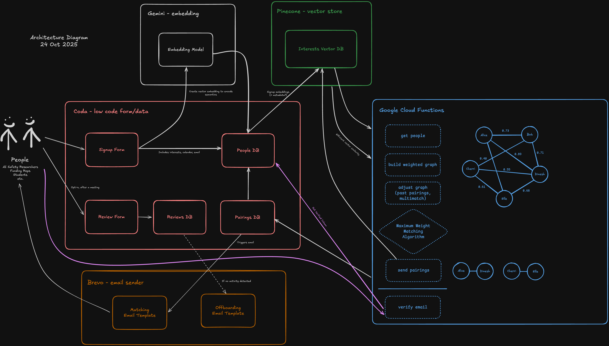

# Architecture

Looks complicated, but can really be broken down into these core parts:

* **Data Databases**: One for people with their name, email, etc; one for pairings; one for reviews
* **Vector Database**: Stores vector embeddings of interests, and metadata
* **Matchmaking Cron Process**: Runs every once in a while to pair people together
* **Embedding Model**: Converts text into a vector that encodes semantics
* **Brevo**: Email sender

There's also an important component of this we maintain: the **[Pinecone Coda Pack](https://github.com/Auroratide/pinecone-coda-integration)**! Yep, didn't exist, so we made it ourselves for the greater Coda community.

## Updating the Diagram

If changes are made, please keep the diagram up-to-date! It uses excalidraw and is version controlled, because I'm a nut who version controls _everything_.

1. Start Excalidraw: `./architecture/draw.sh`
2. Go to `localhost:5000`
3. Load in the `diagram.excalidraw` file.

To save:

1. Save updated diagram to `diagram.excalidraw`.
2. Export to PNG (1x) to `diagram.png`.

By the way, because of the PNG save you get a cool-heckin diff when viewed through Github (:

## Open Questions, Future Considerations

* Handling people who want to be matched multiple times a week. We believe this is possible by duplicating someone's node so they get one match per node they have in the graph.
* A process may be needed to determine who is inactive so we automatically stop matching them and wasting the time of people who are active.
* How do we handle people with different time preferences?
* Lots of error handling needs to be thought through more carefully.
* Can we automatically crawl people's CVs for auto-embedding?

## Decision Log

See: [Decision Log](./DecisionLog.md)
